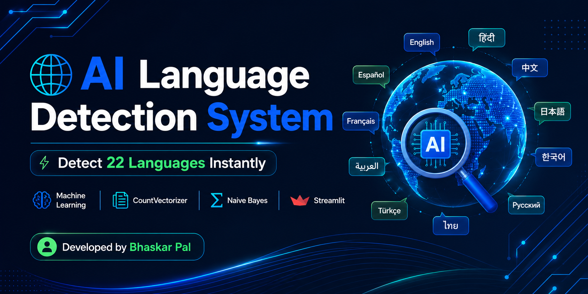
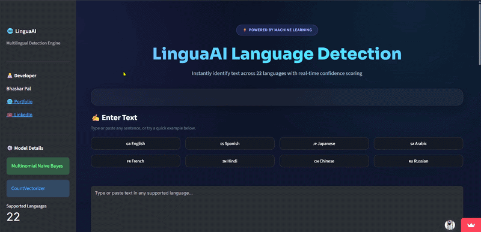
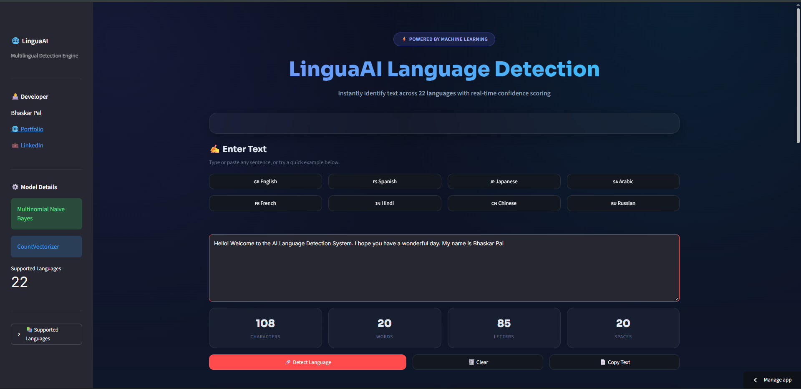
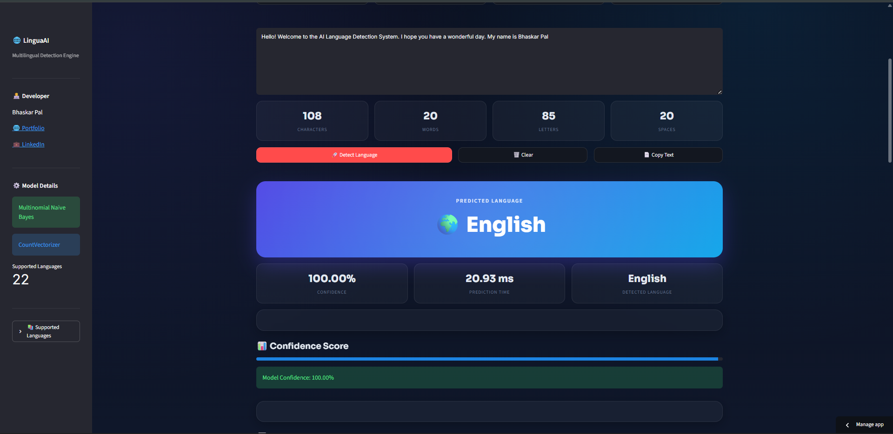
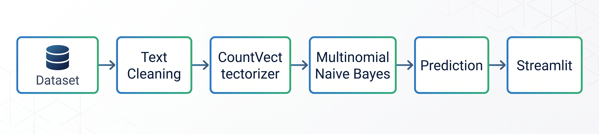

# 🌍 AI Language Detection System

<p align="center">



</p>

<div align="center">

### Detect 22 Languages Instantly Using Machine Learning

A real-time multilingual language detection web application built with **Python**, **Scikit-learn**, **CountVectorizer**, **Multinomial Naive Bayes**, and **Streamlit**.

[](https://language-detection-app-bpal.streamlit.app/)
[]()
[]()
[]()
[]()

</div>

---

## 🚀 Live Demo

🔗 **Live Application:** *(https://language-detection-app-bpal.streamlit.app/)*

---


## 📸 Application Demo

<p align="center">



</p>

| Home | Prediction |
|------|------------|
|  |  |

---

# 📖 Overview

AI Language Detection System is a machine learning-powered web application capable of identifying the language of a given text in real time.

The application uses a **CountVectorizer** to transform text into numerical features and a **Multinomial Naive Bayes** classifier to predict the language. A modern Streamlit interface provides an intuitive experience with confidence scores, probability distribution, and interactive examples.

---

# ✨ Features

- 🌍 Detects **22 Languages**
- ⚡ Real-Time Prediction
- 📊 Confidence Score
- 📈 Top 3 Predicted Languages
- 📋 Interactive Example Inputs
- 📱 Responsive Streamlit Interface
- 🌙 Dark & Light Theme Compatible
- 📚 Model Information Section
- ⚡ Fast Inference
- 🔥 Probability Distribution
- 🚀 Deployment Ready

---

# 🌍 Supported Languages

| Language | Language |
|-----------|-----------|
| Arabic | Japanese |
| Chinese | Korean |
| Dutch | Latin |
| English | Persian |
| Estonian | Portugese |
| French | Pushto |
| Hindi | Romanian |
| Indonesian | Russian |
| Spanish | Swedish |
| Tamil | Thai |
| Turkish | Urdu |

**Total Supported Languages:** **22**

---

# 🧠 ML Workflow

<p align="center">



</p>

---

# 🛠️ Tech Stack

| Category | Technologies |
|----------|--------------|
| Language | Python |
| Machine Learning | Scikit-learn |
| Algorithm | Multinomial Naive Bayes |
| Feature Engineering | CountVectorizer |
| Data Processing | Pandas, NumPy |
| Web Framework | Streamlit |
| Model Serialization | Pickle |
| Version Control | Git & GitHub |

---

# ⚙️ Installation

Clone the repository

```bash
git clone https://github.com/your-username/Language-Detection-App.git
```

Navigate into the project

```bash
cd Language-Detection-App
```

Create a virtual environment

```bash
python -m venv venv
```

Activate the environment

Windows

```bash
venv\Scripts\activate
```

Linux / macOS

```bash
source venv/bin/activate
```

Install dependencies

```bash
pip install -r requirements.txt
```

Run the application

```bash
streamlit run app.py
```

---

# 🎯 Example Predictions

| Input | Prediction |
|--------|------------|
| Hello, How are you? | English |
| Bonjour tout le monde | French |
| नमस्ते आप कैसे हैं | Hindi |
| こんにちは | Japanese |
| مرحبا | Arabic |
| 你好 | Chinese |

---

# 📊 Model Details

| Property | Value |
|----------|--------|
| Algorithm | Multinomial Naive Bayes |
| Vectorizer | CountVectorizer |
| Classification Type | Multi-Class |
| Number of Languages | 22 |
| Deployment | Streamlit |

---

# 🚀 Future Improvements

- Voice-based Language Detection
- Deep Learning Models (LSTM / Transformer)
- Language Translation
- Confidence Visualization Charts
- Prediction History
- REST API Support
- Mobile Responsive Improvements

---

# 🤝 Contributing

Contributions are welcome.

If you'd like to improve the project:

1. Fork the repository
2. Create a new feature branch
3. Commit your changes
4. Push to your branch
5. Open a Pull Request

---

# 👨‍💻 Developer

## Bhaskar Pal

Machine Learning • NLP • Generative AI • Data Analytics

🌐 Portfolio

https://bhaskarpal1707.github.io/portfolio/

💼 LinkedIn

https://www.linkedin.com/in/bhaskar-pal-2k02/

---

## ⭐ Repository Stats

If you found this project useful, consider giving it a ⭐.

It motivates future improvements.

---

# 👨‍💻 About the Developer

Bhaskar Pal

Machine Learning | NLP | Generative AI | Data Analytics

🌐 Portfolio

https://bhaskarpal1707.github.io/portfolio/

💼 LinkedIn

https://www.linkedin.com/in/bhaskar-pal-2k02/
